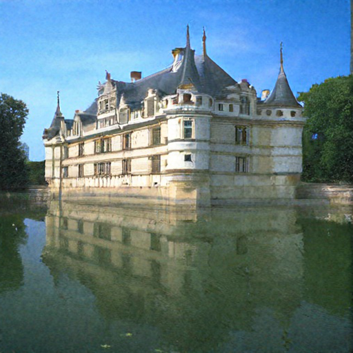

# Study of Outliers and Group-wise Channel Quantization of Diffusion Models

This repository contains the research and implementation for optimizing **Stable Diffusion 2.1 x4 upscaler** models. 
The project focuses on mitigating the computational and memory overhead of diffusion models through an advanced **Group-wise Channel Quantization** strategy, specifically designed to handle high-magnitude outliers in model activations.

---

## 🚀 Research Overview
Diffusion models are state-of-the-art for image generation but suffer from extreme latency and memory requirements. 
This study investigates why standard INT8 quantization often degrades image quality and proposes a solution that balances efficiency with precision by addressing numerical outliers.
Previous work on diffusion models [[1](https://arxiv.org/abs/2501.04304)] has shown the prevalence of outliers in either channel or in a specific pixel index of the activation range. 
This work exploits the fact that these outliers are not random—they are concentrated in specific channels.

### Key Objectives:
* **Outlier Analysis:** Mapping the distribution of activations across UNet modules (Encoder, Decoder, Bottleneck, and Attention layers).
* **Quantization Sensitivity:** Identifying which model blocks (e.g., Up-blocks) are most susceptible to precision loss.
* **Optimization:** Implementing Group-wise Channel Quantization to reduce model size and accelerate inference without significant quality loss.

---

## 🛠 The Quantization Algorithm

The implementation follows a sophisticated pipeline to convert 32-bit floating-point (FP32) weights and activations into 8-bit integers (INT8).

### 1. Min-Max Calibration
The algorithm identifies the dynamic range of data to minimize clipping errors and rounding noise:
* **Range Estimation:** The algorithm determines $x_{min}$ and $x_{max}$ for every quantization unit (layer or group).
* **Scale Factor ($S$):** Calculated as $S = \frac{x_{max} - x_{min}}{2^b - 1}$, where $b=8$. This defines the "step size" for each discrete integer level.
* **Zero-Point ($Z$) Alignment:** An integer offset ensures that the floating-point zero is exactly representable. This is critical for maintaining the integrity of zero-padded regions and ReLU-gated activations.

### 2. Group-wise Partitioning
Standard layer-wise quantization scales all channels based on the single largest outlier, which "squashes" the precision of the remaining values. To solve this, we implement **Group-wise Partitioning**:

1. **Center:** Shift the activation tensor ($X$) by its midpoint $z$ to create ($X'$).
2. **Measure:** Compute $range'_X$ for all activation channels.
3. **Sort:** Reorder $X'$ and weights ($W$) based on descending $range'_X$.
4. **Partition:** Segment sorted tensors into blocks of size $g$.
5. **Quantize:** Calculate local scales/zero-points for each block.
6. **Compute:** Accumulate $Y$ using quantized dot products and scaling.
7. **End:** Return the optimized output tensor $Y$.

### 3. Implementation Enhancements
* **Symmetric vs. Asymmetric Mapping:** Weights are often quantized symmetrically around zero, while activations (which may be all positive) use asymmetric mapping to maximize the 8-bit range.
* **SIMD Alignment:** Group sizes are chosen as powers of two to remain compatible with vectorized integer operations on modern GPU hardware.
* **Clipping & Clamping:** The algorithm performs a final clamp to ensure all transformed values sit strictly within the $[0, 255]$ (unsigned) or $[-128, 127]$ (signed) range.
* **De-quantization for Inference:** During the forward pass, values are simulated in integer precision but de-quantized using $\hat{X} = S \cdot (Q - Z)$ to maintain compatibility with the FP32 model structure.

---

## 📊 Quantitative Results

### Performance Comparison (BSD100 Dataset)
| Quantization Scheme | Mean PSNR | Mean SSIM |
| :--- | :---: | :---: |
| **32-bit (Baseline)** |  23.883 | 0.608 |
| **Layer-wise (INT8)** | 19.921 | 0.296 |
| **Group-wise (G=16, INT8)** | 23.009 | 0.537 |
| **Group-wise (G=32, INT8)** | **23.118** | **0.548** |

### Qualitative Results (Visual Comparison)
| Original (FP32 Baseline) | Group-wise Quantized (G=32) | Group-wise Quantized (G=16) | Group-wise Quantized (G=8) |
| :---: | :---: | :---: | :---: |
|  |  |  | 

### Resource Efficiency
| Metric | Full Precision (FP32) | Quantized (INT8) | Reduction |
| :--- | :---: | :---: | :---: |
| **Model Size** | 1.8 GB | 0.5 GB | **~72%** |
| **Bitwise Ops (BOPs)** | 1,148 TBOPs | 71 TBOPs | **~16×** |

---

## 🧪 Key Findings
* **Up-block Sensitivity:** The Up-block modules (specifically Convolution layers) were found to be the most sensitive to quantization, requiring more granular groups to maintain image quality.
* **Outlier Distribution:** Bottleneck layers exhibit the most stable distributions, while attention mechanisms show high variance across timesteps.
* **Group Size Trade-off:** $G=32$ was determined to be the optimal balance between hardware throughput efficiency and reconstruction accuracy.

---

